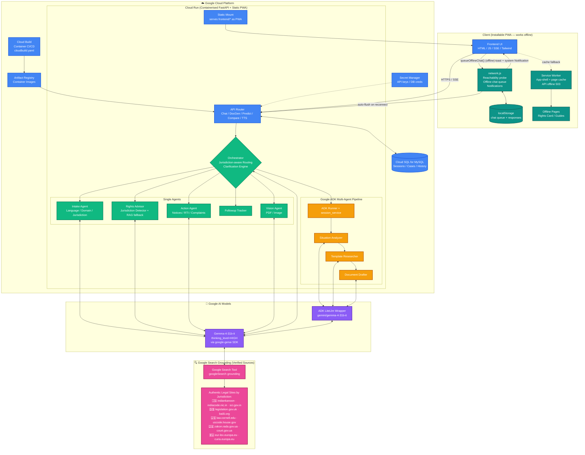

# ⚖️ DHARMA-NYAYA: AI Legal Empowerment Platform

**Empowering every citizen with accessible, multilingual, and actionable legal assistance.**  
*A submission for the Google Gemma 4 Hackathon.*

Dharma-Nyaya bridges the gap between citizens and the legal system by providing an easy-to-use, AI-powered platform for legal guidance, document drafting, and rights awareness. Built entirely on **Gemma 4** and utilizing the **Google ADK** for multi-agent workflows, it delivers real-time assistance in 12+ regional languages.

---

## 🌟 Key Features

*   **🌍 Truly Multilingual (12 Languages):** Speak or type in English, Hindi (हिन्दी), Bengali (বাংলা), Tamil (தமிழ்), Telugu (తెలుగు), Kannada (ಕನ್ನಡ), Marathi (मराठी), Gujarati (ગુજરાતી), Malayalam (മലയാളം), Punjabi (ਪੰਜਾਬੀ), Santali (ᱥᱟᱱᱛᱟᱲᱤ), and Ukrainian (українська). Gemma is instructed to process and strictly respond in the selected regional language.
*   **🤖 Multi-Agent Orchestration (Google ADK):** Features a robust 3-stage agent pipeline (Situation Analyzer ➔ Template Researcher ➔ Document Drafter) built with the Google Agent Development Kit (ADK) to generate ready-to-use legal documents (RTI, notices, complaints).
*   **📄 Multimodal Document Analysis:** Upload legal PDFs, contracts, or images. Gemma 4 analyzes the document to extract summaries, key clauses, and highlight potential risks/traps.
*   **⚡ Real-Time Streaming & Orchestration:** Built on FastAPI, the chat interface uses Server-Sent Events (SSE) to stream Gemma's thinking process to the user, establishing trust and transparency.
*   **📵 PWA & Offline-First (built for remote areas):** Installable Progressive Web App. The full app shell, an **Offline Rights Card** and categorised **Offline Guides** are pre-cached by the service worker and work without internet. A persistent **Offline Mode pill** gives one-tap access to offline content from any page. If a user types a chat question while offline, it is stored locally; when connectivity returns the queue is auto-flushed to the AI and the user is notified (in-app toast + system `Notification`).
*   **♿ WCAG Accessibility:** Semantic HTML, ARIA/Live regions, keyboard-navigable UI, and a dedicated Accessibility Dashboard. Includes Voice-to-Voice TTS capabilities.

---

## 🏗️ Technical Architecture

The platform is fully deployed on **Google Cloud Platform**. Both the FastAPI backend (which also serves the PWA frontend as static assets) run as a single container on **Google Cloud Run**, persisting data to **Cloud SQL for MySQL**. The reasoning core is **Gemma-4-31b-it** invoked via the `google-genai` SDK, with high-stakes document workflows orchestrated through **Google Agent Development Kit (ADK)** agents. Legal references are produced through **Google Search Grounding** — every Chat, Predict, Spot-the-Trap, and Legal Tools response is verified against authentic government and court websites of the **detected jurisdiction** (India, UK, USA, Ukraine, EU, Australia, Canada, etc.) — not from a local KB.



### ☁️ GCP Deployment Stack

| Component | GCP Service | Purpose |
|---|---|---|
| **Backend + Frontend (single container)** | **Cloud Run** | FastAPI serves both `/api/*` JSON endpoints and the static PWA at `/` |
| **Database** | **Cloud SQL for MySQL** | Persistent sessions, cases, message history |
| **Container Build** | **Cloud Build** (`cloudbuild.yaml`) | CI build of Docker image on push |
| **Container Registry** | **Artifact Registry** | Hosts the deployable container image |
| **Secrets** | **Secret Manager** | `GEMINI_API_KEY`, DB credentials, third-party verification keys |
| **AI Inference** | **Google AI Platform (google-genai SDK)** | Gemma-4-31b-it with `thinking_level=HIGH` |
| **Verified References** | **Google Search Grounding** | `googleSearch` tool returns authentic, jurisdiction-correct legal source URLs |

### 🌐 Verified Reference Grounding (replaces local KB)

Every actionable response — **Chat, Predict, Spot-the-Trap, Risk Assessment, Roadmap, and Rights Analysis** — is grounded against **real legal websites** through Google Search:

1. **Jurisdiction Detection** — input language (Cyrillic → Ukraine), explicit mentions ("I am from London" → UK), or cited statutes (GDPR → EU, Companies Act 2006 → UK) determine the legal system.
2. **Source Restriction** — the AI is instructed to cite **only** official sites of the detected jurisdiction (e.g., `legislation.gov.uk` for UK queries, never `indiacode.nic.in`).
3. **Title Humanization** — raw URLs are converted to readable titles (`legislation.gov.uk` → "UK Legislation") and rendered as clickable badges. The user never sees the bare URL.
4. **Clarification First** — if jurisdiction or critical context is missing, the agent asks ONE targeted question instead of guessing.

### Connectivity & Offline Flow (built for remote areas)

1. **Online** — `sendMessage()` in `app.js` POSTs to `/api/chat/stream` and renders the SSE step stream live.
2. **Offline** — `network.js` detects the loss of connectivity (with a 2-failure threshold + 5 s probe timeout to avoid false negatives on weak 2G), `sendMessage()` calls `queueOfflineChat()` which stores the question in `localStorage` under a unique ID, and the user sees a friendly "saved — will send when back online" reply.
3. **Reconnect** — on the next `online` event, `flushOfflineChatQueue()` runs single-flight (preventing duplicate submissions), POSTs each queued question to `/api/chat`, stores the responses, fires an in-app toast plus an optional system `Notification`, and (if `/chat` is open) appends the user/assistant bubbles directly to the conversation.
4. **Always available** — a persistent **Offline Mode** pill in the bottom-left of every page links to cached **Offline Guides** and the **Offline Rights Card**, both of which work entirely without internet.

---

## 🧠 How We Used Gemma 4, Google ADK & Google Search Grounding

1.  **Gemma-4-31b-it:** Served as the core reasoning engine across all agents.
    *   Configured with `thinking_level="HIGH"` for deep legal reasoning.
    *   Used structured prompt instructions (Function/JSON-calling style) for intent routing and jurisdiction detection.
    *   Processed multimodal inputs (PDFs/Images) directly through `client.files.upload` to `client.models.generate_content`.
    *   Invoked through the official `google-genai` Python SDK against Google AI endpoints.
2.  **Google ADK (Agent Development Kit):**
    *   Powers the high-stakes **Document Generation** workflow (`app/agents/docgen_agents.py`).
    *   Uses `Agent`, `Runner`, and `session_service` modules to chain three reasoning steps (Situation → Template → Draft).
    *   Gemma-4-31b-it is wrapped via ADK's `LiteLlm("gemini/gemma-4-31b-it")`.
    *   Single-purpose agents (Intake, Rights, Action, Followup, Vision) follow the same agent pattern with the orchestrator routing between them.
3.  **Google Search Grounding (verified citations):**
    *   Enabled via `GenerateContentConfig(tools=[Tool(google_search=GoogleSearch())])` in `gemma_service.generate_text_with_sources()`.
    *   Returns `grounding_metadata.grounding_chunks` containing real source URLs from the open web.
    *   Replaces a static legal KB — references are **always current** and **always from official jurisdiction-specific sites** (Indian Kanoon, India Code, Supreme Court of India, UK Legislation, Cornell Law, EUR-Lex, Verkhovna Rada, etc.).

---

## 🚀 How to Run This Project

### Prerequisites
*   Python 3.10+
*   Google Gemini / API Key (Access to Gemma models)

### 1. Clone the Repository
```bash
git clone https://github.com/your-username/dharma-nyaya.git
cd dharma-nyaya
```

### 2. Create a Virtual Environment & Install Dependencies
```bash
python -m venv venv

# Activate venv (Windows)
.\venv\Scripts\activate
# Activate venv (Mac/Linux)
source venv/bin/activate

pip install -r requirements.txt
```

### 3. Setup Environment Variables
Create a file named `.env` in the root directory and add your API key:
```env
GEMINI_API_KEY="your_api_key_here"
GEMMA_MODEL="gemma-4-31b-it"
GEMMA_THINKING_LEVEL="HIGH"
```

### 4. Start the Application
Start the FastAPI server using Uvicorn. The `app.main:app` handles both the JSON APIs and serves the static frontend assets.
```bash
uvicorn app.main:app --reload
```

### 5. Access the Platform
Open your browser and navigate to:
**[http://localhost:8000](http://localhost:8000)**

You can find all features right from the landing page. Try chatting in a regional language, clicking the "Offline Rights" badge, or generating an RTI!

---

## 📂 Project Structure

```text
Dharm_Nyaya_AI/
├── app/
│   ├── agents/          # Orchestrator, Intake, Google ADK DocGen, Rights logic
│   ├── api/routes/      # FastAPI endpoints (Chat, DocGen, Document uploads)
│   ├── core/            # Configuration & security (Rate limiting)
│   ├── models/          # Schemas & in-memory DB logic
│   └── services/        # Gemma API Wrappers, PDF processing, RAG stubs
├── frontend/            # Static UI (Vanilla HTML/CSS/JS)
│   ├── assets/          # Icons, PWA js logic, Styles
│   ├── sw.js            # Service Worker for Offline Mode
│   └── manifest.json    # PWA configuration
├── requirements.txt     # Python dependencies
└── .env                 # Environment config (ignored in version control)
```

---

## 🔮 Future Roadmap

*   **Production Vector DB:** Replace the RAG stub with Pinecone or ChromaDB loaded with a highly-citated legal corpus (e.g., bare acts, Supreme Court judgments).
*   **Persistent Storage:** Migrate the in-memory SQLite/Dictionary sessions to PostgreSQL for persistent User Case Management.
*   **State-Specific Jurisdiction:** Expand the Intake Agent's capacity to pull specific regional mandates automatically via API tool-calling.

<br>

*Built for the Google Gemma 4 Hackathon 2026. Empowering the law, empowering the citizen.*
