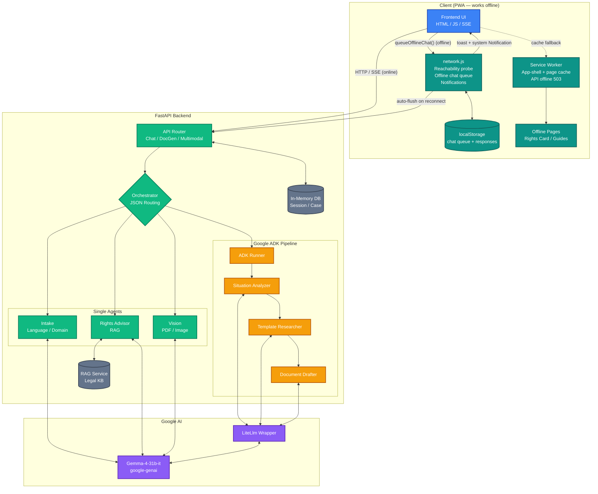

# ⚖️ DHARMA-NYAYA: AI Legal Empowerment Platform

**Empowering every citizen with accessible, multilingual, and actionable legal assistance.**  
*A submission for the Google Gemma 4 Hackathon.*

Dharma-Nyaya bridges the gap between citizens and the legal system by providing an easy-to-use, AI-powered platform for legal guidance, document drafting, and rights awareness. Built entirely on **Gemma 4** and utilizing the **Google ADK** for multi-agent workflows, it delivers real-time assistance in 12+ regional languages.

---

## 🌟 Key Features

*   **🌍 Truly Multilingual (12 Languages):** Speak or type in English, Hindi (हिन्दी), Bengali (বাংলা), Tamil (தமிழ்), Telugu (తెలుగు), Kannada (ಕನ್ನಡ), Marathi (मराठी), Gujarati (ગુજરાતી), Malayalam (മലയാളം), Punjabi (ਪੰਜਾਬੀ), Santali (ᱥᱟᱱᱛᱟᱲᱤ), and Ukrainian (українська). Gemma is instructed to process and strictly respond in the selected regional language.
*   **🤖 Multi-Agent Orchestration (Google ADK):** Features a robust 3-stage agent pipeline (Situation Analyzer ➔ Template Researcher ➔ Document Drafter) built with the Google Agent Development Kit (ADK) to generate ready-to-use legal documents (RTI, notices, complaints).
*   **📄 Multimodal Document Analysis:** Upload legal PDFs, contracts, or images. Gemma 4 analyzes the document to extract summaries, key clauses, and highlight potential risks/traps.
*   **⚡ Real-Time Streaming & Orchestration:** Built on FastAPI, the chat interface uses Server-Sent Events (SSE) to stream Gemma's thinking process to the user, establishing trust and transparency.
*   **📵 PWA & Offline-First (built for remote areas):** Installable Progressive Web App. The full app shell, an **Offline Rights Card** and categorised **Offline Guides** are pre-cached by the service worker and work without internet. A persistent **Offline Mode pill** gives one-tap access to offline content from any page. If a user types a chat question while offline, it is stored locally; when connectivity returns the queue is auto-flushed to the AI and the user is notified (in-app toast + system `Notification`).
*   **♿ WCAG Accessibility:** Semantic HTML, ARIA/Live regions, keyboard-navigable UI, and a dedicated Accessibility Dashboard. Includes Voice-to-Voice TTS capabilities.

---

## 🏗️ Technical Architecture

The platform is a FastAPI backend orchestrating Gemma 4 multi-agent workflows, paired with an installable PWA frontend designed to keep working when the network does not. A dedicated **connectivity module** (`frontend/assets/js/network.js`) holds user chat messages locally while offline and flushes them automatically once the device is back online — making the app usable in rural / low-connectivity areas.



### Connectivity & Offline Flow (built for remote areas)

1. **Online** — `sendMessage()` in `app.js` POSTs to `/api/chat/stream` and renders the SSE step stream live.
2. **Offline** — `network.js` detects the loss of connectivity (with a 2-failure threshold + 5 s probe timeout to avoid false negatives on weak 2G), `sendMessage()` calls `queueOfflineChat()` which stores the question in `localStorage` under a unique ID, and the user sees a friendly "saved — will send when back online" reply.
3. **Reconnect** — on the next `online` event, `flushOfflineChatQueue()` runs single-flight (preventing duplicate submissions), POSTs each queued question to `/api/chat`, stores the responses, fires an in-app toast plus an optional system `Notification`, and (if `/chat` is open) appends the user/assistant bubbles directly to the conversation.
4. **Always available** — a persistent **Offline Mode** pill in the bottom-left of every page links to cached **Offline Guides** and the **Offline Rights Card**, both of which work entirely without internet.

---

## 🧠 How We Used Gemma 4 & Google ADK

1.  **Gemma 4 (31B-IT):** Served as the core reasoning engine.
    *   Configured with `thinking_level="HIGH"` for deep legal reasoning.
    *   Used structured prompt instructions (Function/JSON-calling style) for intent routing.
    *   Processed multimodal inputs (PDFs/Images) directly through `client.files.upload` to `client.models.generate_content`.
2.  **Google ADK:** 
    *   Used specifically for the high-stakes **Document Generation** feature (`app/agents/docgen_agents.py`).
    *   Utilized the `Agent`, `Runner`, and `session_service` modules to chain three distinct reasoning steps (Situation -> Template -> Draft).
    *   Gemma 4 wrapped via ADK's `LiteLlm("gemini/gemma-4-31b-it")`.

---

## 🚀 How to Run This Project

### Prerequisites
*   Python 3.10+
*   Google Gemini / API Key (Access to Gemma models)

### 1. Clone the Repository
```bash
git clone https://github.com/sid321axn/dharma_nyaya_legal_ai.git
cd dharma_nyaya_legal_ai
```

### 2. Create a Virtual Environment & Install Dependencies
```bash
python -m venv venv

# Activate venv (Windows)
.\venv\Scripts\activate
# Activate venv (Mac/Linux)
source venv/bin/activate

pip install -r requirements.txt
```

### 3. Setup Environment Variables
Create a file named `.env` in the root directory and add your API key:
```env
GEMINI_API_KEY="your_api_key_here"
GEMMA_MODEL="gemma-4-31b-it"
GEMMA_THINKING_LEVEL="HIGH"
```

### 4. Start the Application
Start the FastAPI server using Uvicorn. The `app.main:app` handles both the JSON APIs and serves the static frontend assets.
```bash
uvicorn app.main:app --reload
```

### 5. Access the Platform
Open your browser and navigate to:
**[http://localhost:8000](http://localhost:8000)**

You can find all features right from the landing page. Try chatting in a regional language, clicking the "Offline Rights" badge, or generating an RTI!

---

## 📂 Project Structure

```text
Dharm_Nyaya_AI/
├── app/
│   ├── agents/          # Orchestrator, Intake, Google ADK DocGen, Rights logic
│   ├── api/routes/      # FastAPI endpoints (Chat, DocGen, Document uploads)
│   ├── core/            # Configuration & security (Rate limiting)
│   ├── models/          # Schemas & in-memory DB logic
│   └── services/        # Gemma API Wrappers, PDF processing, RAG stubs
├── frontend/            # Static UI (Vanilla HTML/CSS/JS)
│   ├── assets/          # Icons, PWA js logic, Styles
│   ├── sw.js            # Service Worker for Offline Mode
│   └── manifest.json    # PWA configuration
├── requirements.txt     # Python dependencies
└── .env                 # Environment config (ignored in version control)
```

---

## 🔮 Future Roadmap

*   **Production Vector DB:** Replace the RAG stub with Pinecone or ChromaDB loaded with a highly-citated legal corpus (e.g., bare acts, Supreme Court judgments).
*   **Persistent Storage:** Migrate the in-memory SQLite/Dictionary sessions to PostgreSQL for persistent User Case Management.
*   **State-Specific Jurisdiction:** Expand the Intake Agent's capacity to pull specific regional mandates automatically via API tool-calling.

<br>

*Built for the Google Gemma 4 Hackathon 2026. Empowering the law, empowering the citizen.*
